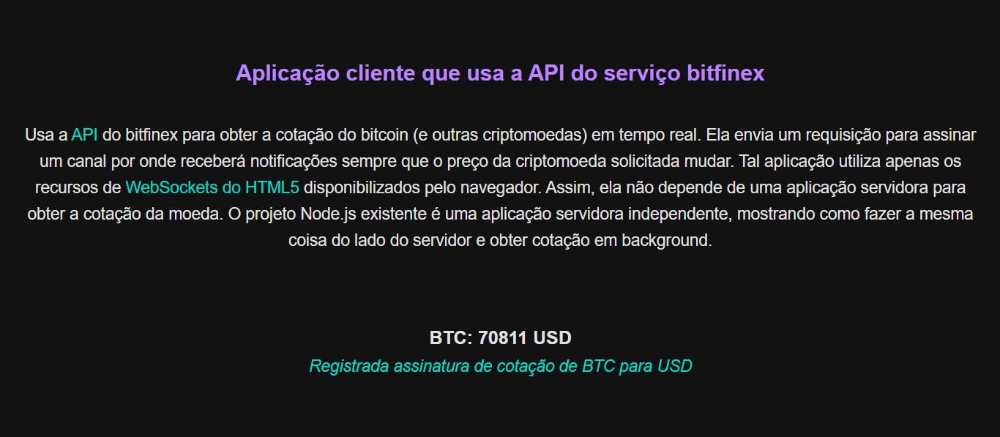

# COTACAO DE CRIPTOMOEDAS
👨‍🏫APLICAÇÃO USA A API DO SERVIÇO PARA OBTER A COTAÇÃO DO BITCOIN (E OUTRAS CRIPTOMOEDAS) COM WEBSOCKETS!

 <br>  
 <br>  

## DESCRIÇÃO:
Aplicação que usa a API do serviço [bitfinex](https://docs.bitfinex.com/reference/ws-public-ticker) para obter a cotação do BitCoin (e outroas criptomoedas) em tempo real. A aplicação envia um requisição para assinar um canal por onde receberá notificações sempre que o preço da criptomoeda solicitada mudar.

## ESTRUTURA DO PROJETO:
O projeto é composto de duas aplicações de exemplo independentes, para mostrar como obter a cotação de criptomoedas tanto no lado servidor quanto no lado cliente. Temos então:

- um backend usando [Node.js](http://nodejs.org) e a biblioteca [ws](https://www.npmjs.com/package/ws) para fazer acesso a serviços usando o protocolo WebSockets.
- um frontend que não depende de nenhum backend, utilizando a classe WebSocket nativa do HTML5.

## BACKEND:
O backend é composto pelos arquivos:
- **BACKEND/bitfinex.js**: Representa a aplicação Node.js que obterá a cotação de uma criptomoeda e imprimirá no terminal.
- **BACKEND/package.json**: Representa o arquivo de configuração da aplicação servidora. Ele foi criando por meio de um assistante, digitando-se `npm init` no terminal. As dependências (bibliotecas utilizadas pela aplicação) foram baixadas e salvas em tal arquivo digitando-se `npm install ws`. No entanto, como o `package.json` já está configurado, não é preciso executar estes dois comandos.
- **BACKEND/Makefile**: Arquivo que pode ser executado com o comando `make` no Linux/macOS para instalar as ferramentas necessárias. Ver seção de instalação abaixo. É interessante abrir tal arquivo para descobrir quais comandos estão sendo executados ao realizar o processo de instalação.

## FRONTEND:
O frontend é composto apenas pelo arquivo `FRONTEND/CODIGO.html`. Ele usa a biblioteca JQuery apenas para facilitar a manipulação dos campos HTML e exibir uma pequena animação quando a cotação da moeda é alterada. Basta dar dois cliques em tal arquivo para abrir o frontend.

## EXECUTANDO O PROJETO - BACKEND:
1. **Instalando as Dependências:**
   - Para instalar as dependências listadas no arquivo "package.json", você pode usar o comando `npm install` no terminal. Certifique-se de estar no diretório `BACKEND`:
   ```bash
   npm install
   ```

2. **Executando o Aplicativo:**
   - Para iniciar o servidor, você deve estar no diretório `BACKEND` e execute o seguinte comando:
   ```bash
   npm start
   ```

   - Acesse o aplicativo no navegador visitando [http://localhost:8080](http://localhost:8080).

## EXECUTANDO O PROJETO - FRONTEND:
   - Basta apenas abrir o arquivo `FRONTEND/CODIGO.html` No navegador de sua preferência.

## NÃO SABE?
- Entendemos que para manipular arquivos em `HTML`, `CSS` e outras linguagens relacionadas, é necessário possuir conhecimento nessas áreas. Para auxiliar nesse aprendizado, oferecemos cursos gratuitos disponíveis:
* [CURSO DE HTML E CSS](https://github.com/VILHALVA/CURSO-DE-HTML-E-CSS)
* [CURSO DE JAVASCRIPT](https://github.com/VILHALVA/CURSO-DE-JAVASCRIPT)
* [CURSO DE NODEJS](https://github.com/VILHALVA/CURSO-DE-NODEJS)
* [CURSO DE WEBSOCKETS](https://github.com/VILHALVA/CURSO-DE-WEBSOCKETS)
* [CURSO DE JQUERY](https://github.com/VILHALVA/CURSO-DE-JQUERY)
* [CONFIRA MAIS CURSOS](https://github.com/VILHALVA?tab=repositories&q=+topic:CURSO)

## CREDITOS:
- [PROJETO CRIADO PELO "manoelcampos"](https://github.com/manoelcampos/sd-websockets)
- [PROJETO EDITADO PELO VILHALVA](https://github.com/VILHALVA)


